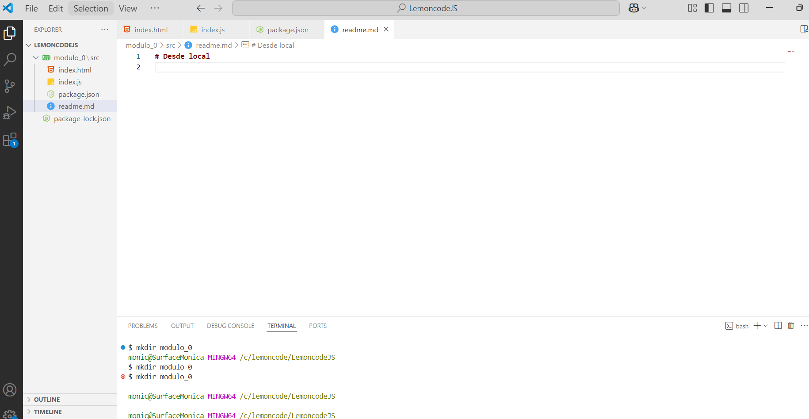
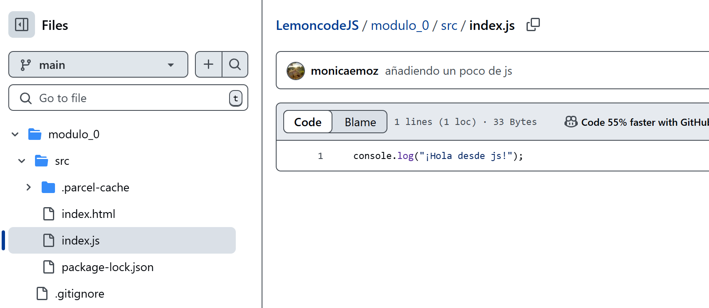

# Desde local

Primero empiezo por crear un repositorio en local, para ello creo un proyecto y lo abro en visual studio, le creo desde la terminal la carpeta que usare para este laboratorio en concreto y sus ficheros correspondientes, ademas instalo las dependencias y arranco el proyecto .
A continuación creo un nuevo proyecto publico en github, para ello antes de nada inicializo el repo en local y me aseguro de meter los archivos q no quiero subir en el .gitignore y ahora si tras comprobar que todo esta como lo deseamos con git status, hago un "git add ." y un "git commit -m" copio la url del nuevo proyecto y hago un "git remote add origin + url" para enlazar la rama que hay en local con el servidor "git push --set-upstream origin master"  ahora al refrescar en github podemos ver que todo esta en orden.
Para continuar creo otra rama llamada "development"  ,hago algunos cambios en los archivos index.html e index.js para que sean diferentes a la rama principal  y lo subo a remoto  y alli podemos ver las diferencias entre ambas ramas 
Hago un merge de la rama "development" a la "main" y hago un push de los cambios a repo de github 
